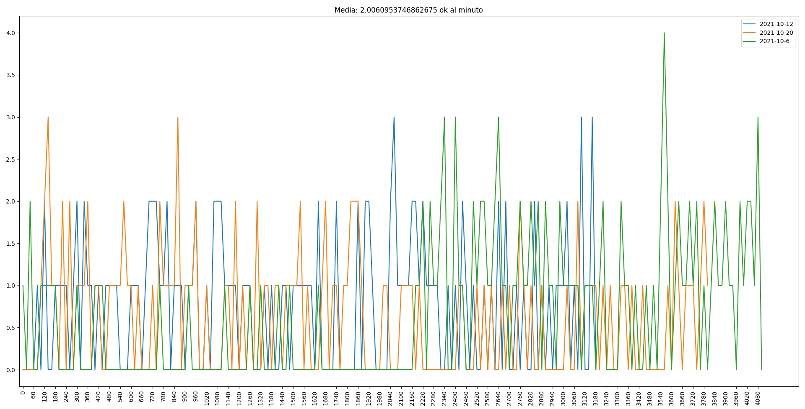

# Programma che conta gli OKKEY 

### Descrizione
Questo programma, dato un file video, conta quante volte viene detta la parola OK a intervalli di 20 secondi.
È inoltre possibile stampare 2 grafici utilizzando i file JSON salvati

## Installazione
### FFMPEG
Prima di poter avviare il programma bisogna avere installato un programma esterno chiamato [FFMPEG](https://www.ffmpeg.org/).
Ed averlo accessibile da linea di comando (solo per [Windows](https://qastack.it/video/20495/how-do-i-set-up-and-use-ffmpeg-in-windows), Linux lo fa in automatico)

### Python e dipendenze
Oltre al programma esterno ovviamente c'è bisogno dell'interprete di [Python3](https://www.python.org/downloads/) e delle sue dipendenze (installabili tramite PIP)
1. [SpechRecognition](https://pypi.org/project/SpeechRecognition/)
1. [Matplotlib](https://pypi.org/project/matplotlib/)

## Utilizzo
### [contatore.py](contatore.py)
Questo file va eseguito per poter analizzare il file video e creare il corrispondente file di salvataggio .json (salvato nella cartella [saves/](saves/)).
La sintassi corretta per eseguire il file è la seguente:
`python contatore.py PERCORSO_FILE`
Dove al posto di `PERCORSO_FILE` va ovviamente inserito il percorso del video scelto

### [graph.py](graph.py)
Questo file si occupa invece di creare un grafico con i dati dei vari file json salvati.
I grafici disponibili saranno due e saranno visualizzati uno dopo l'altro:
#### grafico lineare
Un grafico con alle X intervalli di tempo di 20 secondi e alle Y il numero di OK detti in quell'intervallo:

#### grafico a barre
Un grafico con alle X il file video e alle Y il numero di OK totali detti nel file

